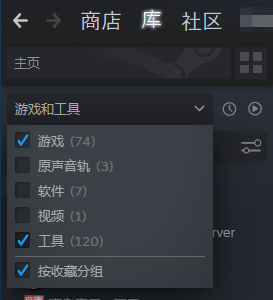
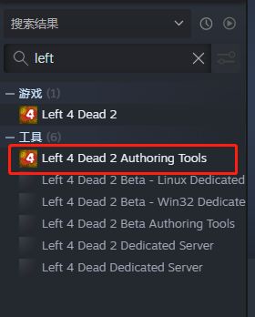

# Left 4 Dead 2 Mod Manage Tool -- 求生之路2模组管理工具
求生之路2模组管理工具（以下简称MMT)是用于管理求生之路2模组的工具集。MMT主要解决模组管理困难问题，最主要的，在模组多的情况下查找和开启/关闭模组困难的问题。此外，许多玩家会刻意将模组移动至本地目录，MMT也解决移动模组后，模组信息不全的问题。

## Installation - 安装
### Requirement - 必要条件
* Windows 7/10 64位
* .NET 5.0.7 或更高
* [vpk](https://developer.valvesoftware.com/wiki/VPK)
* [no_vtf](https://sr.ht/~b5327157/no_vtf/)

### 安装vpk
软件依赖vpk.exe对模组文件进行解包分析，你可以检查 `"[游戏安装路径]\Left 4 Dead 2\bin"`路径中是否有`vpk.exe`。

`vpk.exe`可以在第三方网站上下载，但我推荐在steam上通过安装求生之路2开发者工具来获得程序：

1.打开steam，打开库，在游戏列表上打开分类，勾选"工具"。

2.找到`Left 4 Dead 2 Authoring Tools`，安装软件。(注意，安装前备份好游戏模组，以免安装时模组丢失，我出现过安装开发者工具，导致整个求生之路2重新安装的悲剧)

3.检查安装路径，找到vpk.exe

## Usage - 用法
### 设置
#### vpk模组文件夹
打开菜单"工具->选项"，在弹出的选项菜单中，找到"模组存储位置管理"，通过操作按钮添加模组文件夹。模组文件夹为包含vpk文件的文件夹。

1. 通过"添加位置"来添加文件夹：单击"添加位置"按钮，在弹出的文件夹选择对话框中选择制定文件夹来添加；
1. 通过"从游戏文件夹导入"来添加文件夹：单击"从游戏文件夹导入"按钮，在弹出的文件选择对话框中选择求生之路2可执行程序，软件从该目录自动获取"addon"文件夹和"workshop"文件夹。

设置好文件夹后，单击选项面板的"确定"按钮保存设置。

#### vpk可执行程序
添加vpk路径。

#### no_vtf可执行程序
软件默认自带一个，如有需要可以修改no_vtf可执行程序。

### 扫描模组文件
选择菜单"工具->扫描模组文件"，软件从所有模组文件夹中找到vpk文件，解包读取信息，保存到软件数据库中。

### 搜索模组文件
可以使用搜索栏对模组进行模糊查询，支持通过模组名称、作者、VPKID进行查找。

### 打开模组文件
在主界面的模型列表中对任意模组记录右键，在弹出的菜单选择"在文件管理器中显示"，软件将会打开资源管理器并选择该模组文件。

你也可以直接双击模组记录，软件将调取合适的应用程序打开模组文件。

### 下载创意工坊信息
如果本地信息较少，可以从创意工坊获取更详细的模组信息，但是必须满足条件：

* 模组是从workshop迁移的，并且没有重命名模组文件（默认从创意工坊下载的模组，模组名是"[VPKID].vpk"）。

软件从模组文件名称获取VPKID，使用爬虫在线获取模组信息，记录到本地数据库。之后，模组列表显示的缩略图和名称改为创意工坊的缩略图和名称。

## Develop -- 开发
### Dependency - 依赖

* Visual Studio 2017 / 2019
* .NET 5.0
* Newtonsoft.Json 13.0.1
* System.Data.SQLite 1.0.116
* [vpk](https://developer.valvesoftware.com/wiki/VPK)
* [no_vtf](https://sr.ht/~b5327157/no_vtf/)

## Further Feature - 计划特性
### 模组详细信息
查看模组的本地信息和创意工坊信息  
本地信息包括：
* 缩略图(addonimage)
* 标题(addontitle)
* 版本(addonversion)
* 标语(addontagline)
* 作者(addonauthor)
* 描述(addonDescription)

创意工坊信息包括：
* 预览图(previewImageMain)
* 标题(workshopItemTitle)
* 描述(workshopItemDescriptionTitle)
* 标签(workshopTags)

### 模组别名和自定义标签
为每个模组增加别名和自定义标签，为后续的分类和搜索功能做好准备。

### 分类过滤
增加对模组的分类过滤功能，通过类似创意工坊的多标签分类快速筛选模组。

### 模组启动/关闭
在软件中批量对模组开关，加快游戏载入速度，降低模组管理难度。