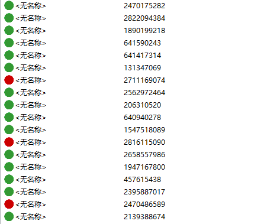

# Left 4 Dead 2 Mod Manage Tool -- 求生之路2模组管理工具
求生之路2模组管理工具（以下简称MMT)是用于管理求生之路2模组的工具集。MMT主要解决模组管理困难问题，最主要的，在模组多的情况下查找和开启/关闭模组困难的问题。此外，许多玩家会刻意将模组移动至本地目录，MMT也解决移动模组后，模组信息不全的问题。

## Installation - 安装
### Requirement - 必要条件
* Windows 7/10 64位
* .NET 5.0.7 或更高
* [no_vtf](https://sr.ht/~b5327157/no_vtf/)

## Usage - 用法
### 设置
#### vpk模组文件夹
打开菜单"工具->选项"，在弹出的选项菜单中，找到"模组存储位置管理"，通过操作按钮添加模组文件夹。模组文件夹为包含vpk文件的文件夹。

1. 通过"添加位置"来添加文件夹：单击"添加位置"按钮，在弹出的文件夹选择对话框中选择制定文件夹来添加；
1. 通过"从游戏文件夹导入"来添加文件夹：单击"从游戏文件夹导入"按钮，在弹出的文件选择对话框中选择求生之路2可执行程序，软件从该目录自动获取"addon"文件夹和"workshop"文件夹。

设置好文件夹后，单击选项面板的"确定"按钮保存设置。

#### no_vtf可执行程序
软件默认自带一个，如有需要可以修改no_vtf可执行程序。

### 扫描模组文件
选择菜单"工具->扫描模组文件"，软件从所有模组文件夹中找到vpk文件，解包读取信息，保存到软件数据库中。

### 搜索模组文件
可以使用搜索栏对模组进行模糊查询，支持通过模组名称、作者、VPKID进行查找。

使用搜索栏边的过滤按钮，按照标签进行过滤，标签需要下载创意工坊信息获取。可以点击已经添加的标签来去除过滤标签。

### 打开模组文件
在主界面的模型列表中对任意模组记录右键，在弹出的菜单选择"在文件管理器中显示"，软件将会打开资源管理器并选择该模组文件。

你也可以直接双击模组记录，软件将调取合适的应用程序打开模组文件。

### 下载创意工坊信息
如果本地信息较少，可以从创意工坊获取更详细的模组信息，但是必须满足条件：

* 模组是从workshop迁移的，并且没有重命名模组文件（默认从创意工坊下载的模组，模组名是"[VPKID].vpk"）。

软件从模组文件名称获取VPKID，使用爬虫在线获取模组信息，记录到本地数据库。之后，模组列表显示的缩略图和名称改为创意工坊的缩略图和名称。

## Develop -- 开发
### Dependency - 依赖

* Visual Studio 2017 / 2019
* .NET 5.0
* Newtonsoft.Json 13.0.1
* System.Data.SQLite 1.0.116
* [no_vtf](https://sr.ht/~b5327157/no_vtf/)

### 设置no_vtf
首先从 https://sr.ht/~b5327157/no_vtf/ 上下载no_vtf，将文件夹解压至编译好的可执行程序目录，更名为"no_vtf-windows_x64"即可。

## Further Feature - 计划特性
### 模组详细信息 [已完成]
查看模组的本地信息和创意工坊信息  
本地信息包括：
* 缩略图(addonimage)
* 标题(addontitle)
* 版本(addonversion)
* 标语(addontagline)
* 作者(addonauthor)
* 描述(addonDescription)

创意工坊信息包括：
* 预览图(previewImageMain)
* 标题(workshopItemTitle)
* 描述(workshopItemDescriptionTitle)
* 标签(workshopTags)

### 模组别名和自定义标签
为每个模组增加别名和自定义标签，为后续的分类和搜索功能做好准备。

### 分类过滤-依照标签 [已完成]
增加对模组的分类过滤功能，通过创意工坊的多标签分类快速筛选模组。

### 分类过滤-依照内容
通过模组内容来对模组进行过滤。

### 模组启动/关闭
在软件中批量对模组开关，加快游戏载入速度，降低模组管理难度。

### SteamAPI支持
通过SteamAPI来管理模组，可以免除梯子以及更快地获取模组信息，但是需要steam启动支持。

## [开发轶事]
记录一些开发过程中的奇妙事宜
### 本地的“幽灵”模组
我在做模组启动/关闭支持特性的测试时发现一个奇怪的现象，我先用MMT关闭了所有模组，接着查看addonlist.txt，对着一排的"0"感到非常满意后，照例启动求生开始测试。  
在附加内容中，我浏览了模组列表，查看有没有“漏网之鱼”，最后点击完成，退出游戏，全程一气呵成，纵享丝滑。随后我再次打开MMT查看模组，然后Emmmmmmm?

有些模组怎么自己启动了？难道有BUG？带着疑问我又去试了几把，总结了一些规律：

1. 确实有模组被自动开启了，而且和MMT无关
1. 被开启的模组都是addons里的，workshop中的模组没有这个现象
1. 求生在启动软件时会修改一次addonlist.txt，在打开附加内容中点击完成后会再修改一次
1. 启动软件时对addonlist.txt的修改仅限于在末尾增加列表中不存在的新模组
1. 在附加内容中点击完成后，一些模组就被开启了

然后我就对着列表一个个模组查看了过去，问题很快就查出来了，只要是本地模组，模组不包含addoninfo.txt的，都会被自动开启！而且在求生的模组列表里是看不到变化的，难怪之前打图，煤气罐被半条命的替换成不能爆炸的模型，气得把所有模组都关了都解决不了，最后还是靠移除vpk才搞定...

总之，只要模组缺失addoninfo.txt，又移动到本地文件夹，就会变成找不到又关不掉的“幽灵”模组。解决办法呢？你可以直接把vpk移除，或者去改addonlist.txt（记得不要去点附加内容），当然，也可以用MMT关闭（记得不要去点附加内容）。